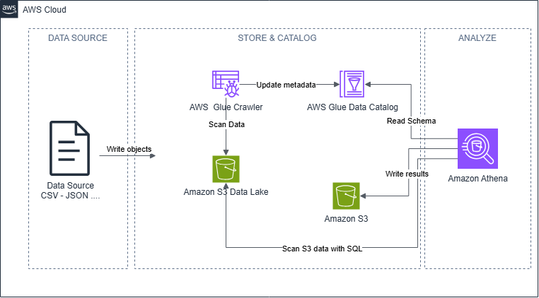

### Week 4 objectives:

* Learn about the AWS Data Lake architecture and the roles of AWS services in data ingestion, storage, cataloging, processing and analysis.

### Tasks completed this week:

| Day | Tasks | Start date | Completion date | Learning resources |
|:---:|---|:---:|:---:|---|
| Wednesday | - Learned about the general architecture of a Data Lake on AWS. &emsp;+ Learned the concept and purpose of a Data Lake. &emsp;+ Identified the different types of data that can be stored in a Data Lake. &emsp;+ Learned the data ingestion, storage, cataloging, processing and analysis workflow. &emsp;+ Learned how Amazon S3 stores raw and processed data. &emsp;+ Learned how AWS Glue Crawler scans data and detects schemas. &emsp;+ Learned how AWS Glue Data Catalog manages metadata. &emsp;+ Learned how Amazon Athena uses SQL to query data stored in Amazon S3. &emsp;+ Studied the Ingest, Store, Catalog, Transform and Analyze layers. &emsp;+ Learned how official AWS service icons are used in architecture diagrams. &emsp;+ Created an S3 Data Lake architecture diagram using AWS service icons. &emsp;+ Learned the basic methods for controlling costs when using Amazon S3, AWS Glue and Amazon Athena. | 26/08/2026 | 26/08/2026 | [AWS Cloud Journey](https://cloudjourney.awsstudygroup.com/) [Amazon S3 User Guide](https://docs.aws.amazon.com/AmazonS3/latest/userguide/Welcome.html) [Using AWS Glue Crawlers with Amazon Athena](https://docs.aws.amazon.com/athena/latest/ug/schema-crawlers.html) |
| Thursday |  | 27/08/2026 |  |  |
| Friday |  | 28/08/2026 |  |  |

### Completed architecture diagram:

  

  <em>Figure 1. AWS S3 Data Lake architecture diagram.</em>

### Week 8 learning outcomes:

&emsp;◉ Wednesday:
 &emsp;&emsp;○ Understood that a Data Lake is a centralized repository capable of storing structured, semi-structured and unstructured data.
 &emsp;&emsp;○ Understood the basic differences between raw data and processed data in a Data Lake architecture.
 &emsp;&emsp;○ Understood that Amazon S3 provides the central storage layer for raw data, processed data and query results.
 &emsp;&emsp;○ Understood that AWS Glue Crawler scans data files in Amazon S3, detects their structures and automatically creates table definitions.
 &emsp;&emsp;○ Understood that AWS Glue Data Catalog stores metadata such as table names, column names, data types, file formats and data locations.
 &emsp;&emsp;○ Understood that Glue Data Catalog manages data descriptions and does not directly store business data.
 &emsp;&emsp;○ Understood that Amazon Athena uses SQL to query data directly from Amazon S3 without requiring a database server.
 &emsp;&emsp;○ Understood the basic workflow: data is stored in Amazon S3, Glue Crawler detects the schema, Glue Data Catalog manages the metadata and Athena performs SQL queries.
 &emsp;&emsp;○ Learned how to read and explain a Data Lake diagram through the Ingest, Store, Catalog, Transform and Analyze layers.
 &emsp;&emsp;○ Learned how to use AWS service icons, connectors and functional areas to present a clear architecture diagram.
 &emsp;&emsp;○ Completed an S3 Data Lake architecture diagram using AWS service icons and English labels.
 &emsp;&emsp;○ Understood that Amazon Athena costs depend on the amount of data scanned and can be optimized by limiting the queried data.
 &emsp;&emsp;○ Understood that AWS Glue Crawler should only be run when the data structure needs to be updated to help control costs.

&emsp;◉ Thursday:

&emsp;◉ Friday:
