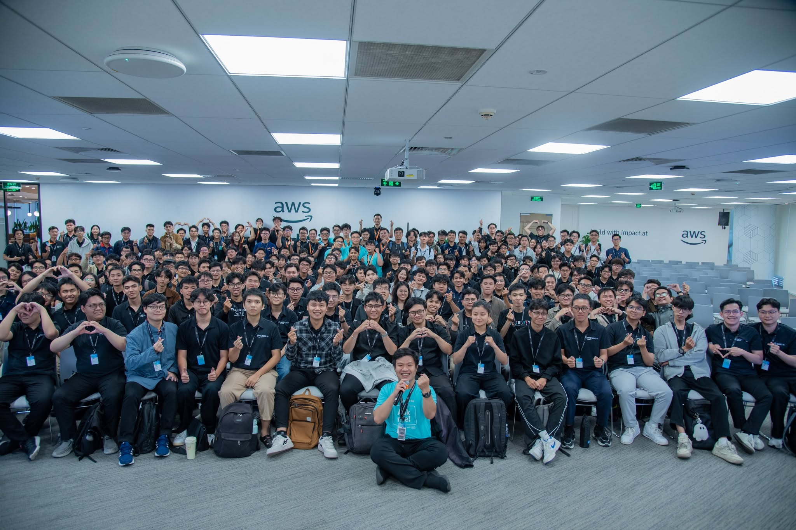
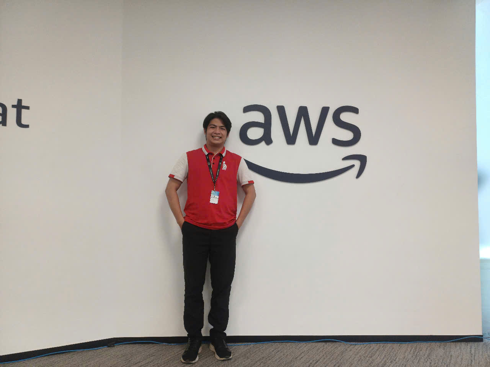

# Summary Report: "AWS Cloud and AI Day Hanoi"
### Event Objectives

- Learn about the latest developments in **cloud computing, artificial intelligence, data, and modern applications**.
- Gain practical insights from **AWS experts, technology professionals, and the cloud community**.
- Explore how AWS technologies can be applied to real-world business and technology challenges.
- Expand my knowledge of current trends in **Cloud, AI, Data Analytics, and modern software development**.

### Event Highlights

#### Cloud Computing and AI

- Explored the latest trends in **cloud computing and artificial intelligence**.
- Learned how cloud infrastructure can support modern AI workloads and digital transformation.
- Gained a broader understanding of how AWS technologies can help organizations innovate faster.

#### Data and Analytics

- Learned about the importance of **data and analytics** in modern organizations.
- Explored how data can be used to support better decision-making and AI applications.
- Improved my understanding of the relationship between **data, analytics, and AI**.

#### Modern Applications

- Learned about modern approaches to application development and architecture.
- Explored technologies related to **cloud-native applications, containers, serverless, and scalable systems**.
- Gained a better understanding of how traditional applications can be modernized using cloud technologies.

#### AI and Emerging Technologies

- Explored the growing role of **Generative AI and Agentic AI**.
- Learned how AI can support developers, businesses, and technology teams.
- Observed how AI is increasingly becoming part of modern software development and business workflows.

### Key Takeaways

#### Technical Knowledge

- Cloud computing and AI are becoming increasingly connected.
- A strong **data foundation** is important for building effective AI solutions.
- Modern applications should be designed with **scalability, flexibility, security, and reliability** in mind.
- AWS provides a wide range of services that can be selected according to different technical requirements.

#### Professional Development

- Continuous learning is essential because cloud and AI technologies evolve rapidly.
- Technical knowledge should always be connected to **real business requirements**.
- Participating in technology events provides valuable opportunities to learn from experienced professionals.

#### Career Perspective

- The event helped me better understand career opportunities related to **Cloud Computing, Data Analytics, and AI**.
- I gained a clearer perspective on the technologies currently used in the industry.
- The experience motivated me to continue improving my AWS and data-related skills.

### Applying to Work

- Apply AWS cloud concepts to my internship and personal projects.
- Continue learning about **AWS services for data analytics and AI**.
- Improve my practical understanding through AWS workshops and hands-on labs.
- Explore how cloud technologies can be integrated with my existing knowledge of **Python, SQL, and web development**.

### Event Experience

Attending **AWS Cloud and AI Day** was a valuable opportunity to experience a large-scale technology event and learn directly from AWS professionals and the technology community.

#### Learning from Experts

- Learned from professionals with practical experience in **cloud, AI, data, and modern applications**.
- Gained a better understanding of current technology trends and real-world applications.
- Observed how technical solutions are connected to business requirements.

#### Technical Exposure

- Participated in technical sessions focused on cloud and AI technologies.
- Expanded my understanding of how AWS services can be combined to build scalable solutions.
- Learned about technologies and approaches that are widely used in the industry.

#### Networking and Community

- Had opportunities to interact with other students, developers, and technology enthusiasts.
- Experienced the collaborative environment of the AWS community.
- Exchanged ideas and gained new perspectives from other participants.

#### Lessons Learned

- Technology should be used to solve meaningful and practical problems.
- Continuous learning and hands-on practice are important for working in the technology industry.
- Cloud, data, and AI knowledge can complement each other and create valuable career opportunities.
- Networking with professionals can provide useful knowledge beyond what is learned in the classroom.

### Some Event Photos

#### Photo 2

